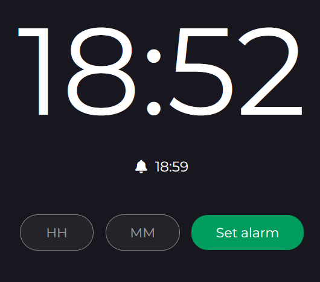

## Alarm Clock

This is a simple clock that allows users set an alarm. Once the set time is equal to the time displayed on the clock, an alarm sound starts 
playing.

### Built With

  &nbsp;
  &nbsp;
  &nbsp;

## Demo
Click [here](https://bernardoyewole.github.io/alarm/) to check it out.

A demo is show below:

